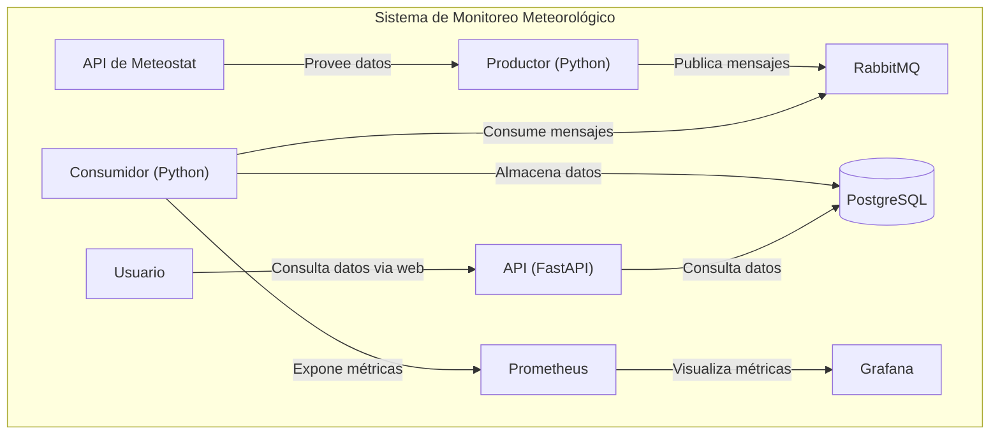
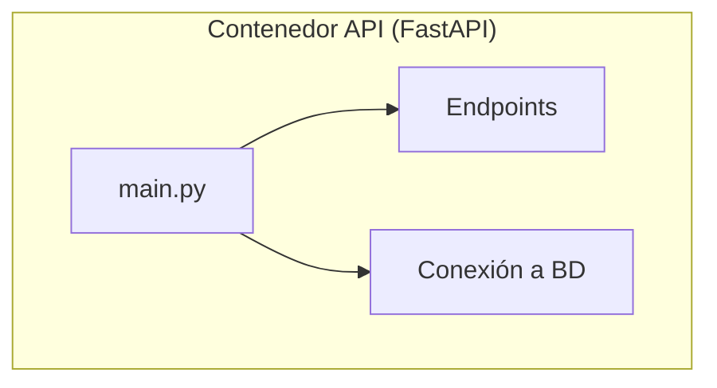
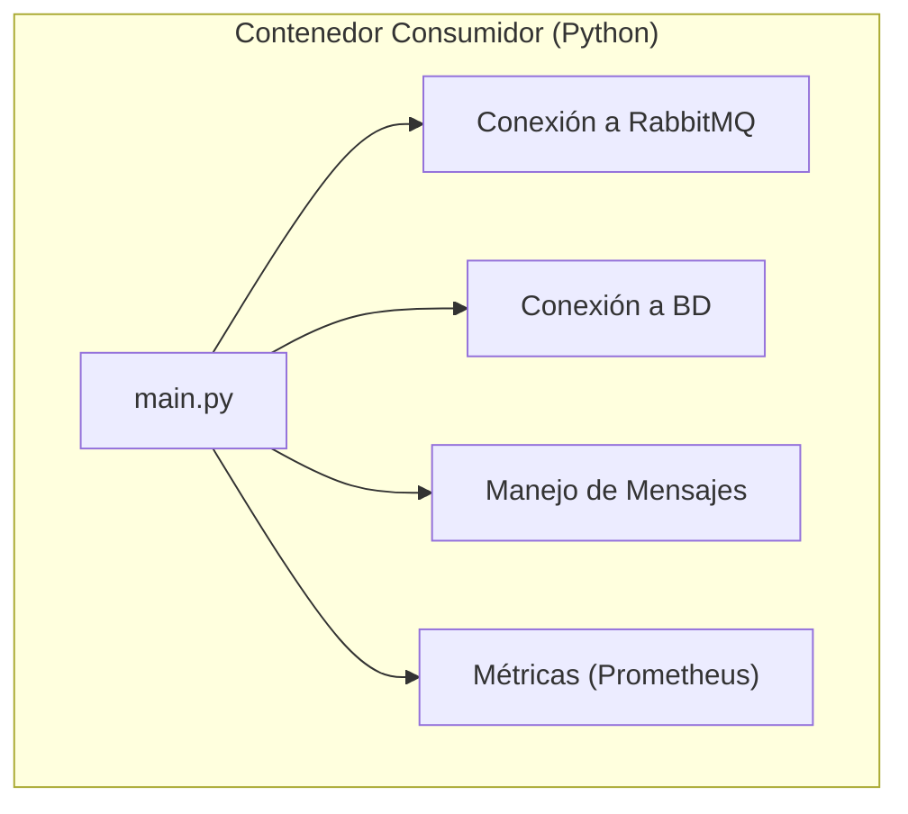

# Sistema de Monitoreo Meteorológico

Este proyecto es un sistema de monitoreo meteorológico que recolecta, almacena y expone datos meteorológicos de una estación específica. Utiliza una arquitectura de microservicios con un productor, un consumidor, una API y una pila de monitoreo.

## Arquitectura

El sistema se compone de los siguientes servicios:

*   **Productor:** Obtiene datos meteorológicos de la API de Meteostat y los publica en un tema de RabbitMQ.
*   **Consumidor:** Se suscribe al tema de RabbitMQ, valida los datos y los almacena en una base de datos PostgreSQL. También expone métricas para Prometheus.
*   **API:** Proporciona una API RESTful para consultar los datos meteorológicos de la base de datos PostgreSQL.
*   **RabbitMQ:** Un intermediario de mensajes que desacopla el productor y el consumidor.
*   **PostgreSQL:** Una base de datos relacional para almacenar los datos meteorológicos.
*   **Prometheus:** Un sistema de monitoreo que recolecta métricas del consumidor.
*   **Grafana:** Una herramienta de visualización para crear paneles de control basados en los datos de Prometheus.

## Cómo Ejecutar

1.  **Clona el repositorio:**
    ```

## Pruebas y Validación

El sistema incluye varias formas de validación y monitoreo para asegurar su correcto funcionamiento.

### Validación de Datos

El consumidor valida los mensajes recibidos de RabbitMQ antes de insertarlos en la base de datos. La validación se realiza en la función `valid(msg)` y comprueba que los valores de temperatura, humedad y presión se encuentren dentro de rangos razonables. Los mensajes inválidos son descartados y se incrementa un contador de métricas (`weather_invalid_msg`) para el monitoreo.

### Monitoreo con Prometheus y Grafana

El sistema expone métricas en formato Prometheus, las cuales pueden ser visualizadas en Grafana. Algunas de las métricas clave son:

*   `weather_inserted_rows`: Número total de registros insertados en la base de datos.
*   `weather_invalid_msg`: Número total de mensajes inválidos recibidos.

Puedes acceder a los paneles de control de Grafana en `http://localhost:3000` para monitorear el estado del sistema en tiempo real.

### Pruebas de Endpoints

Puedes probar los endpoints de la API utilizando herramientas como `curl` o Postman. A continuación se muestran algunos ejemplos de pruebas que puedes realizar:

*   **Verificar que la API está en funcionamiento:**

    ```bash
    curl http://localhost:8000/health
    ```

*   **Obtener los últimos 10 registros de la estación `LEMD`:**

    ```bash
    curl "http://localhost:8000/logs?station=LEMD&limit=10"
    ```

*   **Descargar los datos en formato CSV:**

    ```bash
    curl "http://localhost:8000/logs.csv?station=LEMD" -o weather_data.csv
    ```


## Uso de la API

A continuación se describe cómo utilizar los endpoints de la API.

### Obtener registros meteorológicos

Puedes obtener los registros meteorológicos en formato JSON utilizando el endpoint `/logs`. Este endpoint admite los siguientes parámetros de consulta:

*   `station`: (Opcional) Filtra los registros por el nombre de la estación.
*   `start`: (Opcional) Fecha de inicio para filtrar los registros (formato ISO 8601).
*   `end`: (Opcional) Fecha de fin para filtrar los registros (formato ISO 8601).
*   `limit`: (Opcional) Limita el número de registros devueltos (por defecto 1000).

**Ejemplo:**

```bash
curl "http://localhost:8000/logs?station=LEMD&limit=10"
```

### Obtener registros en formato CSV

Puedes descargar los registros en formato CSV utilizando el endpoint `/logs.csv`.

**Ejemplo:**

```bash
curl "http://localhost:8000/logs.csv?station=LEMD" -o weather_data.csv
```

### Verificación de estado

Puedes verificar el estado de la API y el número de registros en la base de datos utilizando el endpoint `/health`.

**Ejemplo:**

```bash
curl http://localhost:8000/health
```
bash
    git clone https://github.com/tu-usuario/tu-repositorio.git
    cd tu-repositorio
    ```

2.  **Configura las variables de entorno:**
    Crea un archivo `.env` a partir del archivo `.env.example` y completa los valores requeridos. Necesitarás una clave de RapidAPI para acceder a la API de Meteostat.

3.  **Ejecuta los servicios:**
    ```bash
    docker-compose up -d
    ```

## Endpoints de la API

*   `GET /logs`: Obtiene los registros meteorológicos con filtrado opcional por estación, fecha de inicio y fecha de fin.
*   `GET /logs.csv`: Obtiene los registros meteorológicos en formato CSV.
*   `GET /health`: Endpoint de verificación de estado.

## Monitoreo

*   **Prometheus:** `http://localhost:9090`
*   **Grafana:** `http://localhost:3000` (inicia sesión con `admin`/`admin`)

## Diagramas C4

A continuación, se presentan los diagramas C4 que describen la arquitectura del sistema en diferentes niveles de abstracción.

### Nivel 2: Diagrama de Contenedores

Este diagrama descompone el sistema en sus contenedores (aplicaciones, bases de datos, etc.) y muestra las interacciones entre ellos.



### Nivel 3: Diagrama de Componentes

Este diagrama muestra los componentes internos de los contenedores `API` y `Consumidor`.

**Componentes del Contenedor API:**



**Componentes del Contenedor Consumidor:**


