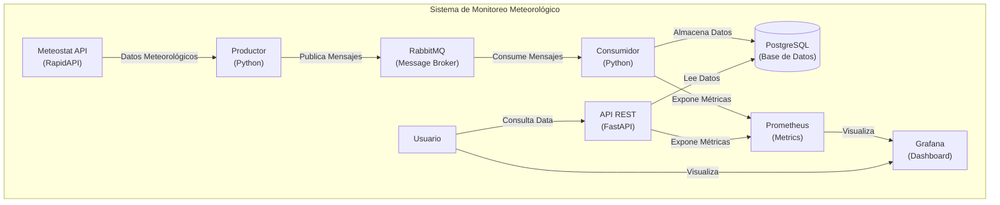
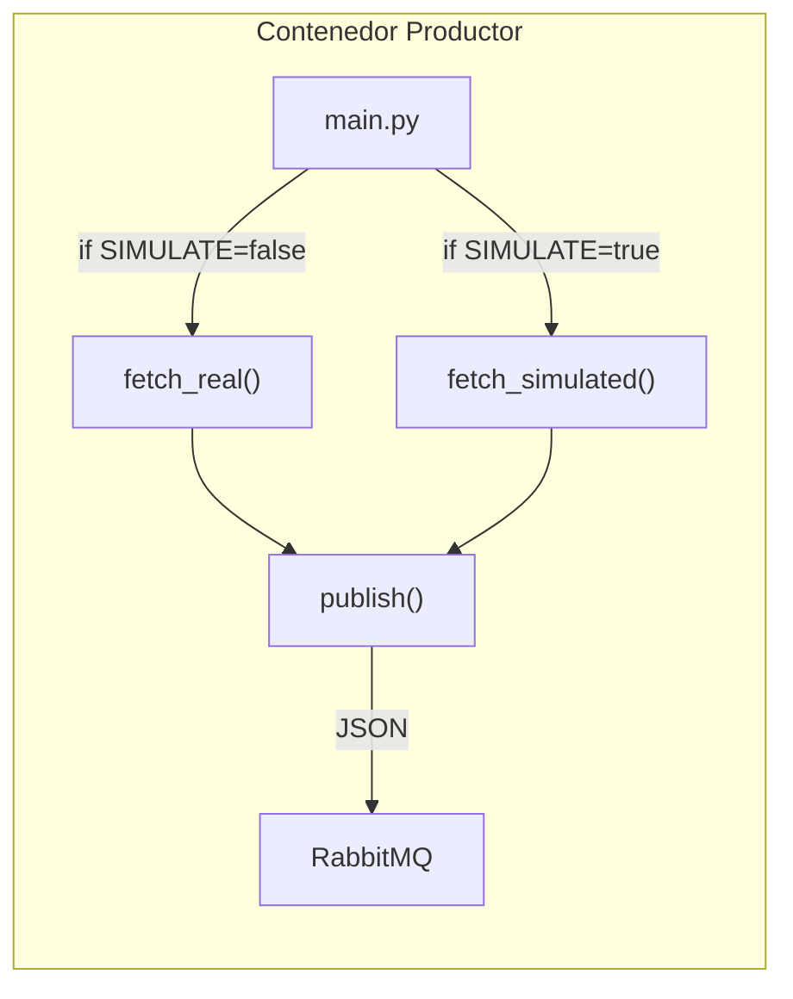
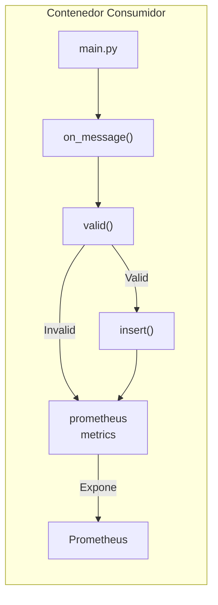
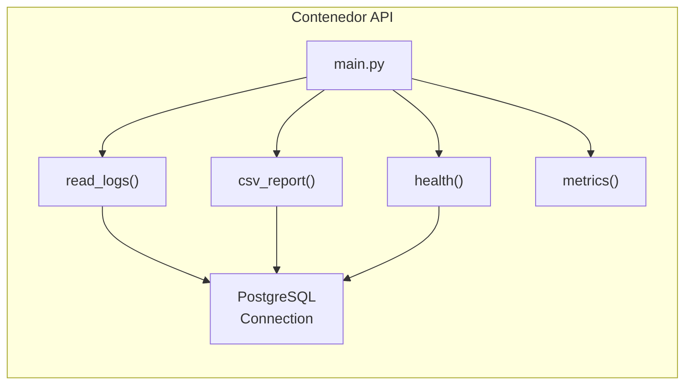

# Sistema de Monitoreo Meteorológico

Este proyecto implementa un sistema de monitoreo meteorológico diseñado para recolectar, almacenar, procesar y exponer datos de estaciones meteorológicas. La arquitectura se basa en microservicios con un patrón productor-consumidor, incluyendo una API RESTful, una pila de monitoreo en tiempo real (Prometheus + Grafana) y persistencia en base de datos relacional.

## Tabla de Contenidos

- [Sistema de Monitoreo Meteorológico](#sistema-de-monitoreo-meteorológico)
  - [Tabla de Contenidos](#tabla-de-contenidos)
  - [Arquitectura](#arquitectura)
  - [Stack Tecnológico](#stack-tecnológico)
  - [Cómo Empezar](#cómo-empezar)
    - [Requisitos Previos](#requisitos-previos)
    - [Instalación](#instalación)
  - [Configuración](#configuración)
    - [Variables de Entorno](#variables-de-entorno)
    - [Configuración del Productor (Meteostat V1)](#configuración-del-productor-meteostat-v1)
    - [Modo Simulado](#modo-simulado)
  - [Componentes del Sistema](#componentes-del-sistema)
    - [Productor](#productor)
    - [Consumidor](#consumidor)
    - [API REST](#api-rest)
    - [RabbitMQ](#rabbitmq)
    - [PostgreSQL](#postgresql)
    - [Prometheus](#prometheus)
    - [Grafana](#grafana)
  - [Uso de la API](#uso-de-la-api)
    - [Endpoints Disponibles](#endpoints-disponibles)
    - [Ejemplos de Uso](#ejemplos-de-uso)
  - [Monitoreo y Métricas](#monitoreo-y-métricas)
    - [Acceso a Grafana](#acceso-a-grafana)
    - [Métricas Disponibles](#métricas-disponibles)
  - [Arquitectura en Diagramas C4](#arquitectura-en-diagramas-c4)
    - [Nivel 2 – Diagrama de Contenedores](#nivel-2--diagrama-de-contenedores)
    - [Nivel 3 – Diagrama de Componentes](#nivel-3--diagrama-de-componentes)
  - [Esquema de Base de Datos](#esquema-de-base-de-datos)
  - [Pruebas y Validación](#pruebas-y-validación)
    - [Validación de Datos](#validación-de-datos)
    - [Health Checks](#health-checks)
    - [Pruebas de Endpoints](#pruebas-de-endpoints)
  - [Solución de Problemas](#solución-de-problemas)
  - [Documentación Adicional](#documentación-adicional)

## Arquitectura

El sistema está compuesto por los siguientes servicios orquestados con Docker Compose:

- **Productor:** Obtiene datos meteorológicos de la API de Meteostat (vía RapidAPI) o genera datos simulados, y los publica en un tema de RabbitMQ.
- **Consumidor:** Se suscribe al tema de RabbitMQ, valida los datos meteorológicos, los almacena en PostgreSQL y expone métricas para Prometheus.
- **API REST:** Proporciona endpoints para consultar los datos meteorológicos almacenados en PostgreSQL. También expone métricas para Prometheus.
- **RabbitMQ:** Sistema de colas de mensajes que desacopla el productor del consumidor, permitiendo procesamiento asincrónico y confiable.
- **PostgreSQL:** Base de datos relacional para el almacenamiento persistente de logs meteorológicos con índices optimizados.
- **Prometheus:** Sistema de monitoreo que recolecta métricas de los servicios (consumidor y API) en intervalos configurables.
- **Grafana:** Herramienta de visualización que crea dashboards interactivos basados en los datos de Prometheus.

## Stack Tecnológico

| Componente       | Tecnología           | Versión/Detalles       |
| ---------------- | -------------------- | ---------------------- |
| Productor        | Python 3.13+         | FastAPI compatible     |
| Consumidor       | Python 3.13+         | Con soporte Prometheus |
| API              | FastAPI (Python)     | RESTful con Prometheus |
| Base de Datos    | PostgreSQL           | 16-alpine              |
| Cola de Mensajes | RabbitMQ             | 3.12 management-alpine |
| Monitoreo        | Prometheus           | Latest                 |
| Visualización    | Grafana              | Latest                 |
| Orquestación     | Docker Compose       | v3.x                   |
| Fuente de Datos  | Meteostat (RapidAPI) | V1 Hourly              |

## Cómo Empezar

### Requisitos Previos

- **Docker:** v20.10 o superior
- **Docker Compose:** v2.0 o superior
- **Git:** Para clonar el repositorio
- **RapidAPI Key:** (Opcional, si no usas modo simulado)

### Instalación

1. **Clona el repositorio:**

   ```bash
   git clone https://github.com/Oyhs-co/weather-logs-system.git
   cd weather-logs-system
   ```

2. **Copia el archivo de configuración:**

   ```bash
   cp .env.example .env
   ```

3. **Configura las variables de entorno (ver sección de Configuración)**

4. **Inicia todos los servicios:**

   ```bash
   docker-compose up -d
   ```

5. **Verifica que todos los contenedores estén corriendo:**

   ```bash
   docker-compose ps
   ```

## Configuración

### Variables de Entorno

Crea un archivo `.env` en la raíz del proyecto con las siguientes variables:

```env
# ==================== RABBITMQ ====================
RABBITMQ_HOST=rabbitmq
RABBITMQ_USER=guest
RABBITMQ_PASS=guest

# ==================== POSTGRESQL ====================
POSTGRES_HOST=postgres
POSTGRES_DB=weather
POSTGRES_USER=weather
POSTGRES_PASSWORD=weather

# ==================== PRODUCER ====================
STATION=LEMD                              # Código ICAO o ID de la estación
INTERVAL=15                               # Intervalo de consulta en segundos
SIMULATE=true                             # Usar datos simulados (true/false)

# ==================== METEOSTAT (si SIMULATE=false) ====================
RAPIDAPI_KEY=your_rapidapi_key_here      # Tu clave de RapidAPI
METEOSTAT_START=2024-01-01               # Fecha de inicio (YYYY-MM-DD)
METEOSTAT_END=2024-01-02                 # Fecha de fin (YYYY-MM-DD)
METEOSTAT_TZ=UTC                         # Zona horaria (ej: UTC, Europe/Berlin)
METEOSTAT_MODEL=true                     # Usar modelo estadístico para datos faltantes
METEOSTAT_UNITS=metric                   # Sistema de unidades (metric/imperial)

# ==================== PROMETHEUS ====================
PROMETHEUS_PORT=8001                     # Puerto para métricas del consumidor
```

### Configuración del Productor (Meteostat V1)

El productor obtiene datos de la API de Meteostat v1 (accesible vía RapidAPI) con los siguientes parámetros:

- **`STATION`**: Identificador de la estación (código ICAO como `LEMD` o ID numérico como `80022`)
- **`METEOSTAT_START`**: Fecha de inicio del período de consulta (YYYY-MM-DD)
- **`METEOSTAT_END`**: Fecha de fin del período de consulta (YYYY-MM-DD)
- **`METEOSTAT_TZ`**: Zona horaria según base `tz` (ej: `UTC`, `Europe/Berlin`)
- **`METEOSTAT_MODEL`**: Sustituir registros faltantes por modelo estadístico (`true`/`false`). Default: `true`
- **`METEOSTAT_UNITS`**: Sistema de unidades (`metric` o `imperial`). Default: `metric`

**Endpoint de Meteostat:**
```
GET https://meteostat.p.rapidapi.com/stations/hourly
```

**Parámetros de URL:**
```
?station=LEMD&start=2024-01-01&end=2024-01-02&tz=UTC&model=true&units=metric
```

**Ejemplo de configuración mínima:**

```env
STATION=80022
METEOSTAT_START=2024-01-01
METEOSTAT_END=2024-01-01
METEOSTAT_TZ=Europe/Berlin
METEOSTAT_MODEL=true
METEOSTAT_UNITS=metric
RAPIDAPI_KEY=your_key_here
```

**Para obtener tu clave de RapidAPI:**
1. Registrate en https://rapidapi.com/
2. Busca la API "Meteostat"
3. Suscríbete al plan gratuito o de pago
4. Copia tu clave X-RapidAPI-Key

### Modo Simulado

Si estableces `SIMULATE=true` en el `.env`, el productor generará datos meteorológicos sintéticos con variaciones realistas en lugar de consultar la API real:

```env
SIMULATE=true
INTERVAL=60  # Genera un dato cada 60 segundos
```

Esto es útil para desarrollo, testing y demostraciones sin necesidad de una clave RapidAPI.

## Componentes del Sistema

### Productor

**Ubicación:** `./producer/main.py`

Función: Obtiene datos meteorológicos y los publica en RabbitMQ.

**Modos de operación:**

- **Modo Real (`SIMULATE=false`):** Consulta la API de Meteostat v1 vía RapidAPI con los parámetros configurados
- **Modo Simulado (`SIMULATE=true`):** Genera datos sintéticos con variaciones mínimas y realistas

**Datos publicados:**
```json
{
  "station": "LEMD",
  "ts": "2024-01-15T10:30:00+00:00",
  "temp": 15.2,
  "rh": 65,
  "pres": 1013.25,
  "wind": 3,
  "rain": 0.0
}
```

**Características:**
- Reintentos automáticos en caso de error
- Logging detallado de operaciones
- Mensajes persistentes en RabbitMQ
- Routing key basada en código de estación

### Consumidor

**Ubicación:** `./consumer/main.py`

Función: Consume mensajes de RabbitMQ, valida datos e inserta en PostgreSQL.

**Validaciones implementadas:**
- Temperatura: -40°C a 60°C
- Humedad relativa: 0% a 100%
- Presión: 870 hPa a 1100 hPa

**Características:**
- Manejo de duplicados (constraint UNIQUE)
- Contadores de mensajes válidos e inválidos
- Gauge de última temperatura por estación
- Servidor HTTP para métricas Prometheus (puerto 8001)
- Reconocimiento automático de mensajes
- Reintentos configurables para errores transitorios

**Métricas expuestas:**
- `weather_inserted_rows`: Contador de filas insertadas exitosamente
- `weather_invalid_msg`: Contador de mensajes rechazados por validación
- `weather_logs_temp`: Gauge con última temperatura por estación (label: station)

### API REST

**Ubicación:** `./api/main.py`

Puerto: `8000`

Framework: FastAPI con soporte nativo para OpenAPI/Swagger.

**Características:**
- Consultas con filtros avanzados
- Exportación a CSV
- Health checks
- Métricas Prometheus
- Manejo automático de conexiones a PostgreSQL

**Servidor Swagger UI:** http://localhost:8000/docs

### RabbitMQ

Puerto AMQP: `5672`
Puerto Management: `15672` (acceso web: http://localhost:15672, usuario: guest/guest)

**Topología:**
- Exchange: `weather.topic` (topic exchange, durable)
- Queue: `weather.queue` (durable, max-priority: 10)
- Routing key pattern: `#` (todos los mensajes)

**Conexiones:**
- Productor: Publica en `weather.topic` con routing key = `{STATION}`
- Consumidor: Consume desde `weather.queue`

### PostgreSQL

Puerto: `5432`
Credenciales por defecto: `weather`/`weather`

**Base de datos:** `weather`

**Inicialización automática:** Los scripts SQL en `./sql/` se ejecutan al iniciar el contenedor.

### Prometheus

Puerto: `9090`
URL: http://localhost:9090

**Configuración:** `./prometheus/prometheus.yml`

**Targets configurados:**
- Consumer: `http://consumer:8001/metrics`
- API: `http://api:8000/metrics`

**Intervalo de scrape:** 15 segundos (por defecto)

### Grafana

Puerto: `3000`
URL: http://localhost:3000

Credenciales por defecto: `admin`/`admin`

**Provisioning automático:**
- Datasource de Prometheus pre-configurado
- Dashboards personalizados en `./grafana/provisioning/dashboards/`

**Dashboards incluidos:**
- `weather-complete.json`: Vista completa del sistema
- `weather-data.json`: Enfoque en datos meteorológicos

## Uso de la API

### Endpoints Disponibles

| Método | Endpoint      | Descripción                                              | Parámetros                                                |
| ------ | ------------- | -------------------------------------------------------- | --------------------------------------------------------- |
| `GET`  | `/logs`       | Obtiene registros meteorológicos en JSON                 | `station`, `start`, `end`, `limit` (máx 10000)           |
| `GET`  | `/logs.csv`   | Descarga registros en formato CSV                        | `station`, `start`, `end`                                |
| `GET`  | `/health`     | Verificación de estado y conteo de registros             | -                                                         |
| `GET`  | `/metrics`    | Métricas en formato Prometheus                           | -                                                         |
| `GET`  | `/docs`       | Documentación interactiva (Swagger UI)                   | -                                                         |
| `GET`  | `/openapi.json` | Especificación OpenAPI                                  | -                                                         |

### Ejemplos de Uso

**Obtener últimos 10 registros de una estación:**

```bash
curl "http://localhost:8000/logs?station=LEMD&limit=10"
```

Respuesta:
```json
{
  "columns": ["id", "station", "ts", "temp", "rh", "pres", "wind", "rain", "received_at"],
  "rows": [
    [1, "LEMD", "2024-01-15T10:30:00+00:00", 15.2, 65, 1013.25, 3, 0.0, "2024-01-15T10:31:00+00:00"],
    ...
  ]
}
```

**Filtrar por rango de fechas:**

```bash
curl "http://localhost:8000/logs?station=LEMD&start=2024-01-01T00:00:00Z&end=2024-01-15T23:59:59Z&limit=100"
```

**Descargar datos en CSV:**

```bash
curl "http://localhost:8000/logs.csv?station=LEMD" -o weather_data.csv
```

**Verificar estado del sistema:**

```bash
curl http://localhost:8000/health
```

Respuesta:
```json
{
  "status": "ok",
  "rows": 1542
}
```

**Acceder a Swagger UI:**

```
http://localhost:8000/docs
```

## Monitoreo y Métricas

### Acceso a Grafana

1. Abre http://localhost:3000 en tu navegador
2. Login con `admin`/`admin`
3. Navega a **Dashboards** > **weather-complete** o **weather-data**

### Métricas Disponibles

**Métricas del Consumidor (puerto 8001):**

- `weather_inserted_rows`: Total de filas insertadas en BD (Counter)
- `weather_invalid_msg`: Total de mensajes rechazados (Counter)
- `weather_logs_temp`: Última temperatura registrada por estación (Gauge con label `station`)

**Métricas de la API (puerto 8000):**

- `api_requests_total`: Total de requests por endpoint y método HTTP (Counter)
- `api_request_duration_seconds`: Duración de requests por endpoint (Histogram)

**Ejemplo de consulta Prometheus:**

```promql
rate(weather_inserted_rows[5m])  # Tasa de inserciones por minuto
weather_logs_temp{station="LEMD"}  # Última temperatura de LEMD
```

## Arquitectura en Diagramas C4

### Nivel 2 – Diagrama de Contenedores



### Nivel 3 – Diagrama de Componentes

**Componentes Internos - Productor:**



**Componentes Internos - Consumidor:**



**Componentes Internos - API:**



## Esquema de Base de Datos

**Tabla: `weather_logs`**

```sql
CREATE TABLE IF NOT EXISTS weather_logs(
    id          BIGSERIAL PRIMARY KEY,
    station     TEXT,
    ts          TIMESTAMPTZ,
    temp        NUMERIC(4,1),
    rh          INTEGER,
    pres        NUMERIC(6,2),
    wind        INTEGER,
    rain        NUMERIC(5,2),
    received_at TIMESTAMPTZ DEFAULT now(),
    UNIQUE(station, ts)
);
CREATE INDEX idx_station_ts ON weather_logs(station, ts);
```

**Descripción de columnas:**

| Columna     | Tipo            | Descripción                              |
| ----------- | --------------- | ---------------------------------------- |
| `id`        | BIGSERIAL       | Identificador único (PK)                 |
| `station`   | TEXT            | Código ICAO o ID de la estación          |
| `ts`        | TIMESTAMPTZ     | Timestamp del registro meteorológico     |
| `temp`      | NUMERIC(4,1)    | Temperatura en °C (rango -99.9 a 99.9)  |
| `rh`        | INTEGER         | Humedad relativa en % (0-100)            |
| `pres`      | NUMERIC(6,2)    | Presión en hPa (rango 870-1100)         |
| `wind`      | INTEGER         | Velocidad del viento en km/h             |
| `rain`      | NUMERIC(5,2)    | Precipitación en mm                      |
| `received_at` | TIMESTAMPTZ   | Timestamp de inserción (auto)            |

**Constraints:**
- `UNIQUE(station, ts)`: Evita duplicados por estación y timestamp
- `idx_station_ts`: Índice para búsquedas rápidas por estación y rango temporal

## Pruebas y Validación

### Validación de Datos

El consumidor implementa validaciones estrictas antes de insertar en la BD:

- **Temperatura:** -40°C ≤ temp ≤ 60°C
- **Humedad Relativa:** 0% ≤ rh ≤ 100%
- **Presión:** 870 hPa ≤ pres ≤ 1100 hPa

Datos inválidos son rechazados y contabilizados en la métrica `weather_invalid_msg`.

### Health Checks

**Consumidor - Verifica conectividad con RabbitMQ y PostgreSQL:**

```bash
curl http://localhost:8001/metrics
```

**API - Verifica conectividad con PostgreSQL:**

```bash
curl http://localhost:8000/health
```

**Docker Compose - Health checks automáticos:**

```yaml
rabbitmq:
  healthcheck:
    test: ["CMD", "rabbitmq-diagnostics", "ping"]
    interval: 10s
    timeout: 5s
    retries: 5

postgres:
  healthcheck:
    test: ["CMD-SHELL", "pg_isready -U weather"]
    interval: 10s
    timeout: 5s
    retries: 5
```

### Pruebas de Endpoints

**Script de prueba completo (bash):**

```bash
#!/bin/bash

echo "Testing Health Check..."
curl http://localhost:8000/health && echo ""

echo -e "\nTesting Logs Endpoint..."
curl "http://localhost:8000/logs?station=LEMD&limit=5" && echo ""

echo -e "\nTesting CSV Export..."
curl "http://localhost:8000/logs.csv?station=LEMD" -o weather.csv
echo "CSV descargado: weather.csv"

echo -e "\nTesting Metrics..."
curl http://localhost:8000/metrics | head -20 && echo ""

echo -e "\nAll tests completed!"
```

**Verificar estado de contenedores:**

```bash
docker-compose ps
docker-compose logs -f consumer  # Logs del consumidor
docker-compose logs -f producer  # Logs del productor
docker-compose logs -f api       # Logs de la API
```

## Solución de Problemas

Para obtener ayuda con problemas comunes, consulta el archivo [troubleshooting.md](troubleshooting.md).

**Problemas frecuentes:**

- **Error de conexión a RabbitMQ:** Verifica que el servicio esté corriendo y accesible
- **Error de validación de datos:** Revisa que los valores estén dentro de los rangos permitidos
- **Postgres no inicializa:** Borra volúmenes con `docker-compose down -v` y reinicia
- **API retorna 0 registros:** Verifica que el productor y consumidor estén activos
- **Grafana no muestra datos:** Comprueba que Prometheus tiene datos en `/targets`

## Documentación Adicional

- **[Manual de Usuario](USER_MANUAL.md)** - Guía completa de instalación, configuración y uso
- **[Troubleshooting](troubleshooting.md)** - Solución de problemas comunes
- **[Swagger UI](http://localhost:8000/docs)** - Documentación interactiva de endpoints
- **[Grafana Dashboards](http://localhost:3000)** - Visualización de métricas en tiempo real
- **[RabbitMQ Management](http://localhost:15672)** - Panel administrativo de colas

---

**Última actualización:** Noviembre 2025  
**Licencia:** Ver [LICENSE](LICENSE)