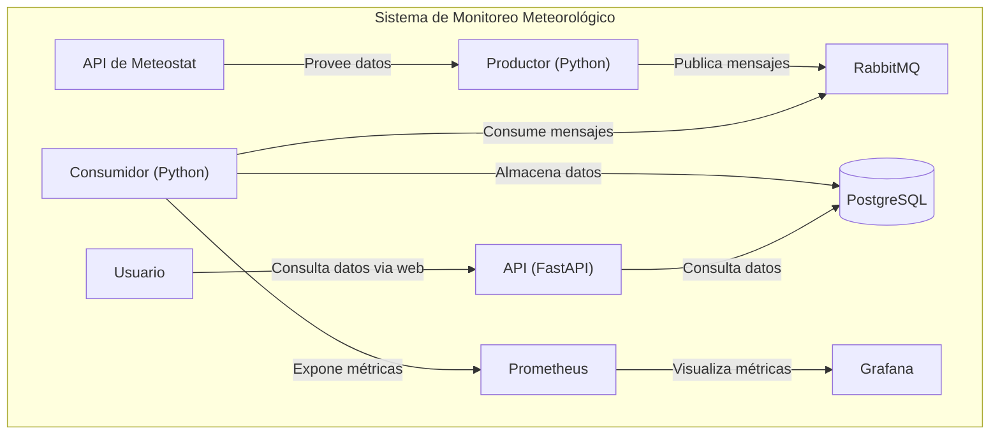
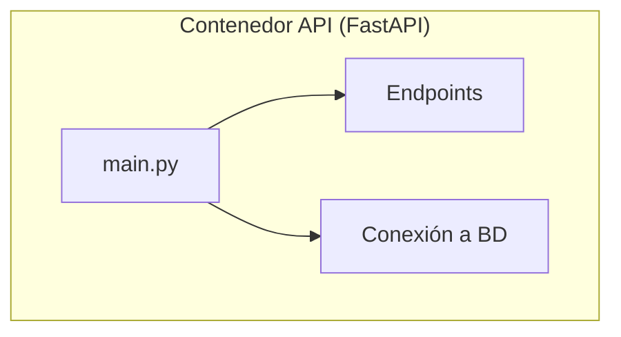
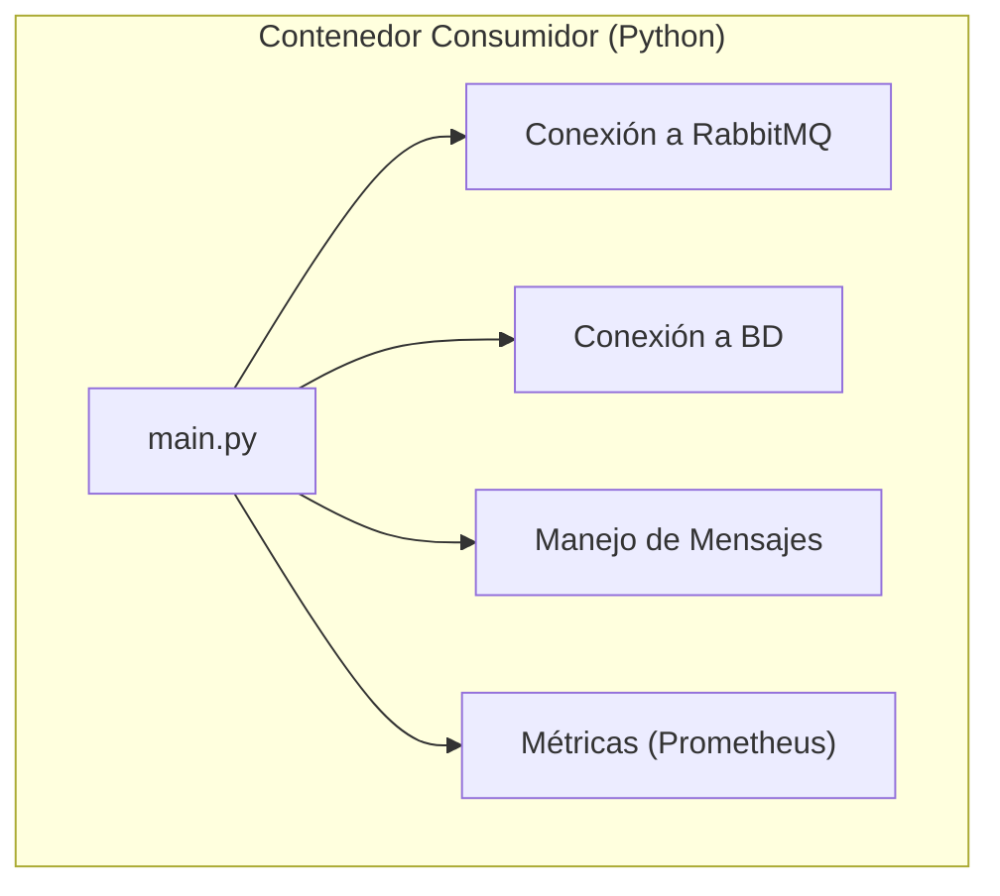

# Sistema de Monitoreo Meteorológico

Este proyecto implementa un sistema de monitoreo meteorológico diseñado para recolectar, almacenar y exponer datos de una estación específica. La arquitectura se basa en microservicios, incluyendo un productor, un consumidor, una API y una pila de monitoreo.

## Tabla de Contenidos

- [Sistema de Monitoreo Meteorológico](#sistema-de-monitoreo-meteorológico)
  - [Tabla de Contenidos](#tabla-de-contenidos)
  - [Arquitectura](#arquitectura)
  - [Stack Tecnológico](#stack-tecnológico)
  - [Cómo Empezar](#cómo-empezar)
  - [Configuración de la Clave RapidAPI](#configuración-de-la-clave-rapidapi)
  - [Uso de la API](#uso-de-la-api)
    - [Obtener registros meteorológicos](#obtener-registros-meteorológicos)
    - [Obtener registros en formato CSV](#obtener-registros-en-formato-csv)
    - [Verificación de estado](#verificación-de-estado)
  - [Endpoints de la API](#endpoints-de-la-api)
  - [Monitoreo](#monitoreo)
  - [Diagramas C4](#diagramas-c4)
    - [Nivel 2 – Diagrama de Contenedores](#nivel-2--diagrama-de-contenedores)
    - [Nivel 3 – Diagrama de Componentes](#nivel-3--diagrama-de-componentes)
  - [Pruebas y Validación](#pruebas-y-validación)
    - [Validación de Datos](#validación-de-datos)
    - [Monitoreo con Prometheus y Grafana](#monitoreo-con-prometheus-y-grafana)
    - [Pruebas de Endpoints](#pruebas-de-endpoints)
  - [Solución de Problemas](#solución-de-problemas)
  - [Manual de Usuario](#manual-de-usuario)

## Arquitectura

El sistema está compuesto por los siguientes servicios:

- **Productor:** Obtiene datos meteorológicos de la API de Meteostat y los publica en un tema de RabbitMQ.
- **Consumidor:** Se suscribe al tema de RabbitMQ, valida los datos y los almacena en una base de datos PostgreSQL. También expone métricas para Prometheus.
- **API:** Proporciona una API RESTful para consultar los datos meteorológicos de la base de datos PostgreSQL.
- **RabbitMQ:** Actúa como un intermediario de mensajes que desacopla el productor y el consumidor.
- **PostgreSQL:** Base de datos relacional para el almacenamiento de los datos meteorológicos.
- **Prometheus:** Sistema de monitoreo que recolecta métricas del consumidor.
- **Grafana:** Herramienta de visualización para crear paneles de control basados en los datos de Prometheus.

## Stack Tecnológico

| Componente       | Tecnología       |
| ---------------- | ---------------- |
| Productor        | Python           |
| Consumidor       | Python           |
| API              | FastAPI (Python) |
| Base de Datos    | PostgreSQL       |
| Cola de Mensajes | RabbitMQ         |
| Monitoreo        | Prometheus       |
| Visualización    | Grafana          |
| Orquestación     | Docker Compose   |

## Cómo Empezar

1.  **Clona el repositorio:**

    ```bash
    git clone https://github.com/tu-usuario/tu-repositorio.git
    cd tu-repositorio
    ```

2.  **Configura las variables de entorno:**
    Crea un archivo `.env` a partir del archivo `.env.example` y completa los valores requeridos.

3.  **Ejecuta los servicios:**
    ```bash
    docker-compose up -d
    ```

## Configuración de la Clave RapidAPI

Para que el productor pueda obtener datos de la API de Meteostat, es necesario configurar una clave de RapidAPI.

1.  **Crea un archivo `.env`** en la raíz del proyecto, puedes copiar el contenido de `.env.example`.
2.  **Obtén tu clave de RapidAPI:**
    - Ve a [RapidAPI](https://rapidapi.com/) y crea una cuenta.
    - Busca la API de "Meteostat" y suscríbete a ella.
    - Copia tu clave de RapidAPI.
3.  **Agrega la clave al archivo `.env`:**
    ```
    RAPIDAPI_KEY=tu_clave_de_rapidapi
    ```

## Uso de la API

A continuación, se describe cómo utilizar los endpoints de la API.

### Obtener registros meteorológicos

Puedes obtener los registros meteorológicos en formato JSON utilizando el endpoint `/logs`.

**Ejemplo:**

```bash
curl "http://localhost:8000/logs?station=LEMD&limit=10"
```

### Obtener registros en formato CSV

Puedes descargar los registros en formato CSV utilizando el endpoint `/logs.csv`.

**Ejemplo:**

```bash
curl "http://localhost:8000/logs.csv?station=LEMD" -o weather_data.csv
```

### Verificación de estado

Puedes verificar el estado de la API y el número de registros en la base de datos utilizando el endpoint `/health`.

**Ejemplo:**

```bash
curl http://localhost:8000/health
```

## Endpoints de la API

| Método | Endpoint    | Descripción                                           |
| ------ | ----------- | ----------------------------------------------------- |
| `GET`  | `/logs`     | Obtiene los registros meteorológicos en formato JSON. |
| `GET`  | `/logs.csv` | Obtiene los registros meteorológicos en formato CSV.  |
| `GET`  | `/health`   | Endpoint de verificación de estado.                   |

## Monitoreo

- **Prometheus:** `http://localhost:9090`
- **Grafana:** `http://localhost:3000` (inicia sesión con `admin`/`admin`)

## Diagramas C4

A continuación, se presentan los diagramas C4 que describen la arquitectura del sistema en diferentes niveles de abstracción.

### Nivel 2 – Diagrama de Contenedores

Este diagrama descompone el sistema en sus contenedores (aplicaciones, bases de datos, etc.) y muestra las interacciones entre ellos.



### Nivel 3 – Diagrama de Componentes

Este diagrama muestra los componentes internos de los contenedores `API` y `Consumidor`.

**Componentes del Contenedor API:**



**Componentes del Contenedor Consumidor:**



## Pruebas y Validación

El sistema incluye varias formas de validación y monitoreo para asegurar su correcto funcionamiento.

### Validación de Datos

El consumidor valida los mensajes recibidos de RabbitMQ antes de insertarlos en la base de datos. Los mensajes inválidos son descartados y se incrementa un contador de métricas (`weather_invalid_msg`) para el monitoreo.

### Monitoreo con Prometheus y Grafana

El sistema expone métricas en formato Prometheus, las cuales pueden ser visualizadas en Grafana. Algunas de las métricas clave son:

- `weather_inserted_rows`: Número total de registros insertados en la base de datos.
- `weather_invalid_msg`: Número total de mensajes inválidos recibidos.

Puedes acceder a los paneles de control de Grafana en `http://localhost:3000` para monitorear el estado del sistema en tiempo real.

### Pruebas de Endpoints

Puedes probar los endpoints de la API utilizando herramientas como `curl` o Postman.

- **Verificar que la API está en funcionamiento:**

  ```bash
  curl http://localhost:8000/health
  ```

- **Obtener los últimos 10 registros de la estación `LEMD`:**

  ```bash
  curl "http://localhost:8000/logs?station=LEMD&limit=10"
  ```

- **Descargar los datos en formato CSV:**

  ```bash
  curl "http://localhost:8000/logs.csv?station=LEMD" -o weather_data.csv
  ```

## Solución de Problemas

Para obtener ayuda con problemas comunes, consulta el archivo [troubleshooting.md](troubleshooting.md).

## Manual de Usuario

Para obtener una guía detallada sobre la configuración, ejecución y pruebas del sistema, consulta el [Manual de Usuario](USER_MANUAL.md).
